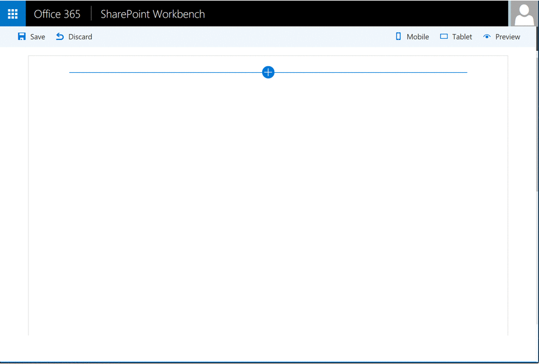
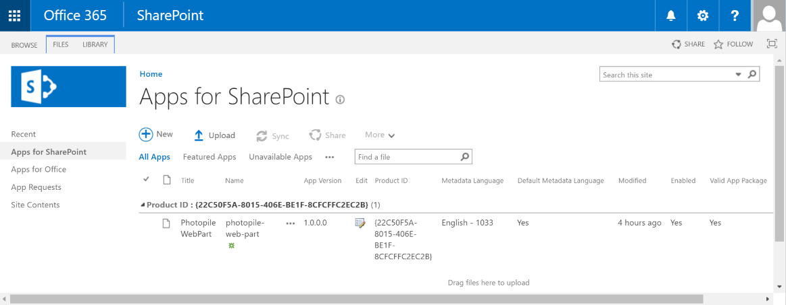
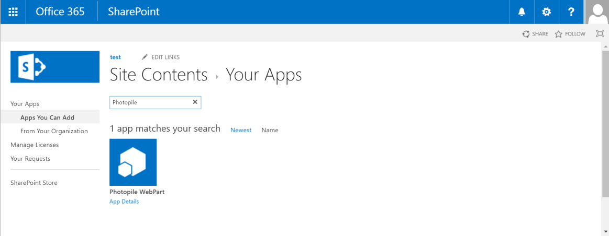
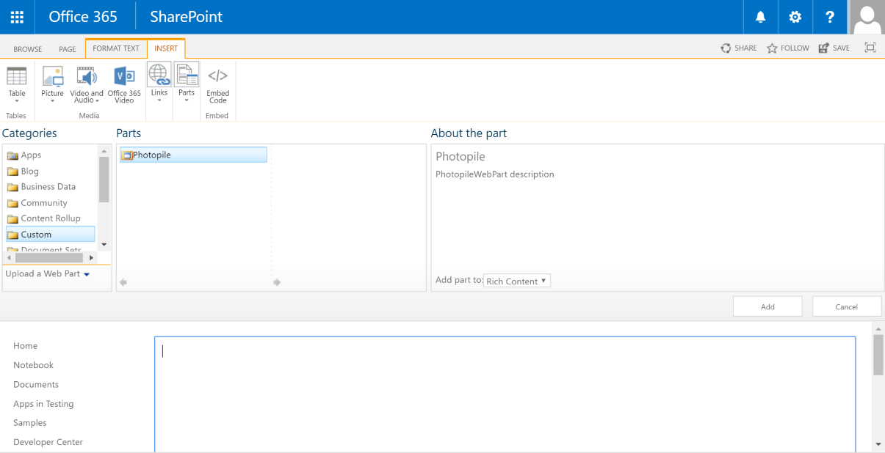
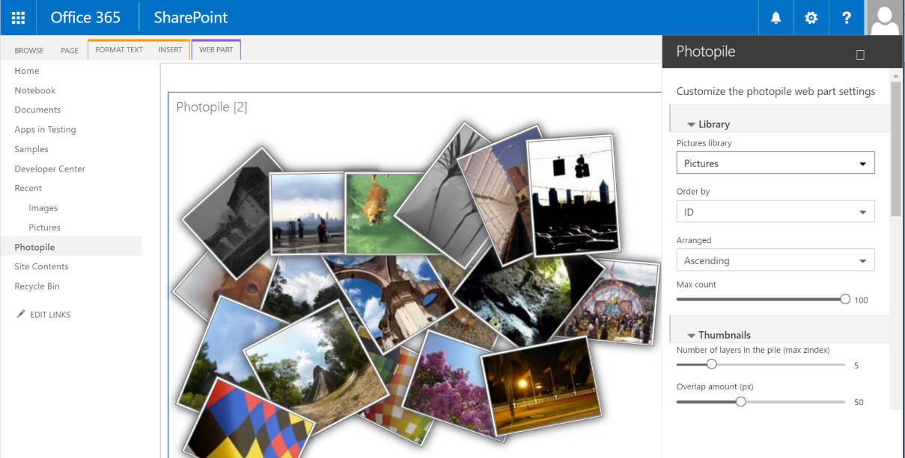

## Photopile Web Part

The photopile-web-part project is a SharePoint web part built using the SharePoint Framework (SPFx) in the preview version.
This project implements the great [Photopile.Js](https://github.com/bigbhowell/Photopile-JS) created by Brian W. Howell
(a popular jquery script) as a client side web part for SharePoint.

With this Web Part, you can display the photos contained in a SharePoint Pictures Library as a cool image gallery that
simulates a pile of photos scattered about on a surface. Thumbnail clicks remove photos from the pile,
(enlarging them as if being picked up by the user), and once in  view a secondary click returns the photo to the pile.



> Note: The SharePoint Framework is currently in preview and is subject to change. SharePoint Framework client-side web parts are not currently supported for use in production enviornments.

## Run this web part in the SharePoint workbench

```bash
git clone the repo
npm i
tsd install
gulp serve
```

If you need more information about to develop SharePoint Framework client side web part, deploy and test it on your workbench
station, you can consult the following tutorial: https://github.com/SharePoint/sp-dev-docs/wiki/Setup-SharePoint-Tenant

## Features

This web part uses React, Office UI Fabric, JQuery, JQuery UI and Photopile.js. This web part is available in English (en-us)
and French (fr-fr). You can use this web part with SharePoint Online (Office 365) or SharePoint Server 2016.

It is able to:
* List Picture Libs contained in the current SharePoint web site
* List all the pictures in the selected List
* Render the pics as a cool photopile
* Personalize the layout thanks to editable settings

If you are a SharePoint web developer, you can be interested by the following code patterns :
* Include JQuery and external framework in your solution
* Implement rich web part properties panel with controls like DropDown, Sliders, Toggle, etc.
* Load dynamic data from SharePoint as web part properties
* Load dynamic data from SharePoint REST Services, as lists or items
* Implement mock system to test your solution in the local workbench or on a SharePoint site
* Include Office UI Fabric controls in your project
* Render content with React
* Etc.

## How to use it in the local or the SharePoint workbench

By compiling this code on a configured workstation, you can test this web part on your local SharePoint workbench
or on a developer site. Please follow the tutorials in the SPFx tutorial to know the process : https://github.com/SharePoint/sp-dev-docs/wiki/Setup-SharePoint-Tenant

## How to use it in a SharePoint site as a SPApp

You can also test this web part directly as SharePoint App (spapp package).

_**IMPORTANT: Please note that the SharePoint Framework (SPFx) is currently in public preview, so this kind of client side web part are not supported in a production site.**_

To test the web part on a SharePoint site, follow this steps :

1. Download the [photopile-web-part.spapp](./sharepoint/photopile-web-part.spapp) on your desktop
2. Connect on your tenant with a SharePoint Online administor account, and go in the App Catalog web site
3. Insert the web part in your tenant App catalog (drag & drop the photopile-web-part.spapp in the **App for SharePoint** list and click to "Deploy" in the popin window. The App must appear in your list

4. Go to a SharePoint web site (for example the developer site), and go to the **Site contents** web page. Click on **New** and **Add app**
5. In the apps search page, search **Photopile** and click on the App to install it

6. When the app is deployed, go to a SharePoint page, click on edit, and insert the **Photopile** webpart from the **Custom** group:

7. Edit the web part properties, and click on **Configure** button in the web part properties
8. Now you can modify the Client side web part properties to select a pics lib and view the result


_Note: be sure to have Picture Lis in your site, if not, create it and upload images inside._

##The MIT License (MIT)

Copyright (c) 2016 Olivier Carpentier

Permission is hereby granted, free of charge, to any person obtaining a copy of this software and associated documentation files (the "Software"), to deal in the Software without restriction, including without limitation the rights to use, copy, modify, merge, publish, distribute, sublicense, and/or sell copies of the Software, and to permit persons to whom the Software is furnished to do so, subject to the following conditions:

The above copyright notice and this permission notice shall be included in all copies or substantial portions of the Software.

THE SOFTWARE IS PROVIDED "AS IS", WITHOUT WARRANTY OF ANY KIND, EXPRESS OR IMPLIED, INCLUDING BUT NOT LIMITED TO THE WARRANTIES OF MERCHANTABILITY, FITNESS FOR A PARTICULAR PURPOSE AND NONINFRINGEMENT. IN NO EVENT SHALL THE AUTHORS OR COPYRIGHT HOLDERS BE LIABLE FOR ANY CLAIM, DAMAGES OR OTHER LIABILITY, WHETHER IN AN ACTION OF CONTRACT, TORT OR OTHERWISE, ARISING FROM, OUT OF OR IN CONNECTION WITH THE SOFTWARE OR THE USE OR OTHER DEALINGS IN THE SOFTWARE.
