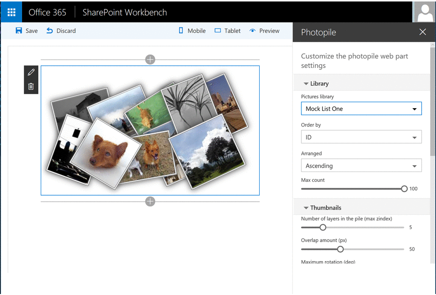

## Photopile Web Part

The photopile-web-part project is a SharePoint web part built using the SharePoint Framework (SPFx) in the preview version.
This project implements the great [Photopile.Js](https://github.com/bigbhowell/Photopile-JS) popular jquery script as a client side web part for SharePoint.
With this Web Part, you can display the photos contained in a SharePoint Pictures Library as a cool image gallery that
simulates a pile of photos scattered about on a surface. Thumbnail clicks remove photos from the pile,
(enlarging them as if being picked up by the user), and once in  view a secondary click returns the photo to the pile.



## Run this web part

```bash
git clone the repo
npm i
tsd install
gulp serve
```

## Features


## How to use it


